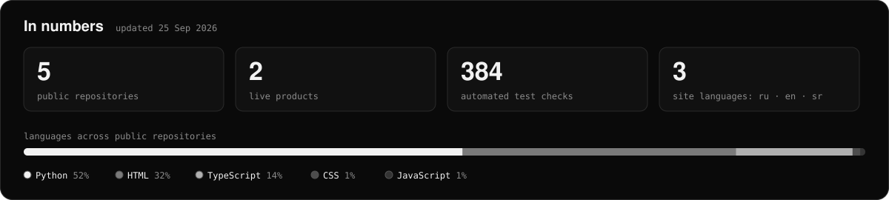

  

I build small products end to end: **Telegram bots**, **scrapers and automation**, and **websites** for small businesses. From the first spec to a running service, deployed and maintained. Based in Montenegro, open to freelance work.

<table>
  <tr>
    <td width="50%"></td>
    <td width="50%"></td>
  </tr>
  <tr>
    <td width="50%"></td>
    <td width="50%"></td>
  </tr>
</table>

  Code: <a href="https://github.com/uprtrk/flip-tracker">flip-tracker</a> ·
  <a href="https://github.com/uprtrk/translator-hn">translator-hn</a> ·
  <a href="https://github.com/uprtrk/dvadruga-site">dvadruga-site</a> ·
  FitnessBot code is private, the bot is live

### Stack

### Contact

Telegram: **[@uprtrk](https://t.me/uprtrk)**

<b>По-русски</b>

 

Делаю небольшие продукты целиком: **Telegram-боты**, **парсеры и автоматизация**, **сайты** для малого бизнеса. От ТЗ до работающего сервиса с деплоем и поддержкой. Живу в Черногории, беру заказы на фриланс.

Написать: Telegram **[@uprtrk](https://t.me/uprtrk)**

